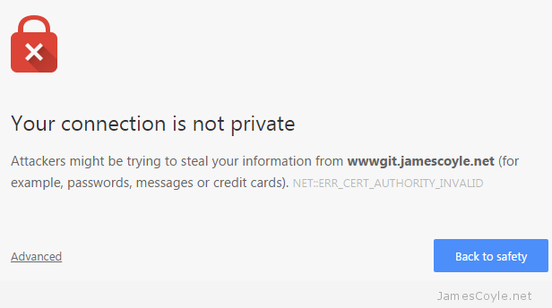

If you host something like this yourself, you’ll probably have entered the world called self signed certificates. These are SSL certificates that have not been signed by a known and trusted certificate authority. There is no security concern using a self signed certificate, the level of security will be similar to a paid for certificate, the problem is that your commuter won’t know that it can trust the certificate. You may have seen this error in a Web Browser, such as Chrome:

 
With Git, however, you’ll get an error from the git command line tool similar to the below:

    $ git clone https://wwwgit.jamescoyle.net/test/test-project.git
       Cloning into 'test-project'...
       fatal: unable to access 'https://james.coyle@wwwgit.jamescoyle.net/test/test-project.git/': SSL certificate problem: unable to get local issuer certificate

The preferred method of dealing with this error is to add the Certificate Authority’s signing certificate as a trusted Certificate Authority on your computer.The way to do this differs depending on your OS and is out of scope for this post.

There are two Git specific methods of forcing Git to accept the self signed certificates, which don’t require you to import the CA certificate to your computers Trusted  CA store:
Turn off Git SSL Verification

You can stop the Git client from verifying your servers certificate and to trust all SSL certificates you use with the Git client. This has it’s own security risks as you would not be warned if there was a valid problem with the server you are trying to connect to.

That said, it’s the quickest and easiest fix for a non trusted server certificate. Simply run the below git command on your Git client.

    git config --global http.sslVerify false

Tell Git Where Your Certificate Authority Certificates Are

Another option is to point your Git client towards a folder that contains the Certificate Authority certificate that was used to sign your Git server’s SSL certificate. You may not have one of these if you’re using Self Signed certificates.

Save the CA certificate to a folder on your Git client and run the following git command to tell your Git client to use it when connecting t the server:

    git config --system http.sslCAPath /git/certificates
    git config --global http.sslVerify false
    git -c http.sslVerify=false clone https://example.com/path/to/git
    git config --global http.sslVerify false
 # Initial clone
GIT_SSL_CAINFO=/etc/ssl/certs/rorcz_root_cert.pem \
    git clone https://repo.or.cz/org-mode.git

# Ensure all future interactions with origin remote also work
cd org-mode
git config http.sslCAInfo /etc/ssl/certs/rorcz_root_cert.pem