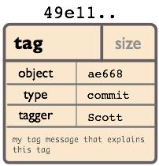

# Git 使用参考

## Git 基本概念
### GIT对象
- SHA

  Git中所有用来表示项目历史信息的文件,是通过一个40个字符的(40-digit)“对象名”来索引的,对象名看起来像这样:
     6ff87c4664981e4397625791c8ea3bbb5f2279a3
在Git里到处看到这种“40个字符”字符串。每一个“对象名”都是对“对象”内容做SHA1哈希计算得来的,(SHA1
是一种密码学的哈希算法)。这样就意味着两个不同内容的对象不可能有相同的“对象名”。
这样做会有几个好处:
    - Git只要比较对象名,就可以很快的判断两个对象是否相同。
    - 因为在每个仓库(repository)的“对象名”的计算方法都完全一样,如果同样的内容存在两个不同的仓库
中,就会存在相同的“对象名”下。
    - Git还可以通过检查对象内容的SHA1的哈希值和“对象名”是否相同,来判断对象内容是否正确。

- 对象

  每个对象(object) 包括三个部分:类型、大小和内容。大小就是指内容的大小,内容取决于对象的类型,有四种类
型的对象:"blob"、"tree"、 "commit" 和"tag"。
    - “blob”用来存储文件数据,通常是一个文件。
    - “tree”有点像一个目录,它管理一些“tree”或是 “blob”(就像文件和子目录)
    - 一个“commit”只指向一个"tree",它用来标记项目某一个特定时间点的状态。它包括一些关于时间点的
元数据,如时间戳、最近一次提交的作者、指向上次提交(commits)的指针等等。
    - 一个“tag”是来标记某一个提交(commit) 的方法。

  几乎所有的Git功能都是使用这四个简单的对象类型来完成的。它就像是在你本机的文件系统之上构建一个小的文件系统。
- Blob对象

  一个blob通常用来存储文件的内容.可以使用[git show](git-command-show.md)命令来查看一个blob对象里的内容。假设我们现在有一个Blob对象的SHA1哈希值,我们可以通过下面的的命令来查看内容:

      $ git show 6ff87c4664
        Note that the only valid version of the GPL as far as 
        this project is concerned is _this_ particular version
        of the license (ie v2, not v2.2 or v3.x or whatever),
        unless explicitly otherwise stated....
  
  一个"blob对象"就是一块二进制数据,它没有指向任何东西或有任何其它属性,甚至连文件名都没有.因为blob对象内容全部都是数据,如两个文件在一个目录树(或是一个版本仓库)中有同样的数据内容,那么它们将会共享同一个blob对象。Blob对象和其所对应的文件所在路径、文件名是否改被更改都完全没有关系。

- Tree 对象

   一个tree对象有一串(bunch)指向blob对象或是其它tree对象的指针,它一般用来表示内容之间的目录层次关系。
   [git show](git-command-show.md)命令可以用来查看tree对象,但是[git ls-tree](git-command-ls-tree.md)能看到更多的细节。如果我们有一个tree对象的SHA1哈希值,我们可以像下面一样来查看它:

       $ git ls-tree fb3a8bdd0ce
         100644 blob 63c918c667fa005ff12ad89437f2fdc80926e21c   .gitignore
         100644 blob 5529b198e8d14decbe4ad99db3f7fb632de0439d   .mailmap
         100644 blob 6ff87c4664981e4397625791c8ea3bbb5f2279a3   COPYING
         040000 tree 2fb783e477100ce076f6bf57e4a6f026013dc745   Documentation
         100755 blob 3c0032cec592a765692234f1cba47dfdcc3a9200   GIT-VERSION-GEN
         100644 blob 289b046a443c0647624607d471289b2c7dcd470b   INSTALL
         100644 blob 4eb463797adc693dc168b926b6932ff53f17d0b1   Makefile
         100644 blob 548142c327a6790ff8821d67c2ee1eff7a656b52    README
         ...

   - 一个tree对象包括一串(list)条目,每一个条目包括:mode、对象类型、SHA1值 和名字(这串条目是按名字排序的)。它用来表示一个目录树的内容。
   - 一个tree对象可以指向(reference): 一个包含文件内容的blob对象, 也可以是其它包含某个子目录内容的其它tree对象.Tree对象、blob对象和其它所有的对象一样,都用其内容的SHA1哈希值来命名的;只有当两个tree对象的内容完全相同(包括其所指向所有子对象)时,它的名字才会一样,反之亦然。这样Git就能只通过比较两个相关的tree对象的名字是否相同,来快速的判断其内容是否不同。
    
   **注意:** 在submodules里,trees对象也可以指向commits对象. 请参见 [Submodules](git-command-submodules.md) )

   **注意:** 所有的文件的mode位都是644 或 755,这意味着Git只关心文件的可执行位.

- Commit对象

  "commit对象"指向一个"tree对象", 并且带有相关的描述信息.
  可以用 --pretty=raw 参数来配合 git show 或 git log 去查看某个提交(commit):
  
      $ git show -s --pretty=raw 2be7fcb476
        commit 2be7fcb4764f2dbcee52635b91fedb1b3dcf7ab4
        tree fb3a8bdd0ceddd019615af4d57a53f43d8cee2bf
        parent 257a84d9d02e90447b149af58b271c19405edb6a
        author Dave Watson <dwatson@mimvista.com> 1187576872 -0400
        committer Junio C Hamano <gitster@pobox.com> 1187591163 -0700

            Fix misspelling of 'suppress' in docs
            Signed-off-by: Junio C Hamano <gitster@pobox.com>

  从输出中可以看到, 一个提交(commit)由以下的部分组成:
  - 一个 tree对象: tree对象的SHA1签名, 代表着目录在某一时间点的内容.
  - 父对象 (parent(s)): 提交(commit)的SHA1签名代表着当前提交前一步的项目历史. 上面的那个例子就只有一个父对象; 合并的提交(merge commits)可能会有不只一个父对象. 如果一个提交没有父对象, 那么我们就叫它“根提交"(root commit), 它就代表着项目最初的一个版本(revision). 每个项目必须有至少有一个“根提交"(root commit). 一个项目可能有多个"根提交“,虽然这并不常见(这不是好的作法).
  - 作者 : 做了此次修改的人的名字,还有修改日期.
  - 提交者：提交者(committer): 实际创建提交(commit)的人的名字, 同时也带有提交日期. TA可能会和作者不是同一个人; 例如作者写一个补丁(patch)并把它用邮件发给提交者, 由他来创建提交(commit).
  - 注释： 用来描述此次提交.
  
  **注意:**  一个提交(commit)本身并没有包括任何信息来说明其做了哪些修改; 所有的修改(changes)都是通过与父提交(parents)的内容比较而得出的. 值得一提的是, 尽管git可以检测到文件内容不变而路径改变的情况, 但是它不会去显式(explicitly)的记录文件的更名操作. (参见[git diff](git-command-diff.md)中 -M 参数的用法)，一般用 git commit 来创建一个提交(commit), 这个提交(commit)的父对象一般是当前分支(current HEAD),同时把存储在当前索引(index)的内容全部提交.

- 对象模型

   现在我们已经了解了3种主要对象类型(blob, tree 和 commit), 好现在就让我们大概了解一下它们怎么组合到一起的.如果我们一个小项目, 有如下的目录结构

      #tree
        |
        |-- README
        |-- lib
        |-- inc
        |-- tricks.java
        `-- mylib.java
        2 directories, 3 files

    如果我们把它提交(commit)到一个Git仓库中, 在Git中它们看起来就如下图:
    

    可以看到: 每个目录都创建了 tree对象,对象 (包括根目录), 每个文件都创建了一个对应的 blob对象 . 最后有一个commit对象指向根tree对象(root of trees), 这样我们就可以追踪项目每一项提交内容.
- 标签对象

    
    
    一个标签对象包括一个对象名(译者注:就是SHA1签名), 对象类型, 标签名, 标签创建人的名字("tagger"), 还有一条可能包含有签名(signature)的消息. 你可以用 [git cat-file](git-command-cat-file.md) 命令来查看这些信息:

        $ git cat-file tag v1.5.0
        object 437b1b20df4b356c9342dac8d38849f24ef44f27
        type commit
        tag v1.5.0
        tagger Junio C Hamano <junkio@cox.net> 1171411200 +0000

        -----BEGIN PGP SIGNATURE-----
        Version: GnuPG v1.4.6 (GNU/Linux)
        iD8DBQBF0lGqwMbZpPMRm5oRAuRiAJ9ohBLd7s2kqjkK
        lq1qqC57SbnmzQCdG4uinLE/L9aUXdWeTFPron96DLA=
        =2E+0
        -----END PGP SIGNATURE-----

    点击 git tag, 可以了解如何创建和验证标签对象. (注意: git tag 同样也可以用来创建 "轻量级的标签"(lightweight tags),但它们并不是标签对象, 而只一些以 "refs/tags/" 开头的引用罢了).
### GIT目录与工作目录
- Git目录

  'Git目录'是为你的项目存储所有历史和元信息的目录 - 包括所有的对象(commits,trees,blobs,tags), 这些对象指向不同的分支.

  每一个项目只能有一个'Git目录'(这和SVN,CVS的每个子目录中都有此类目录相反), 这个叫'.git'的目录在你项目的根目录下(这是默认设置,但并不是必须的). 如果你查看这个目录的内容, 你可以看所有的重要文件:
  
      #tree -L 1
        .
        |-- HEAD         # 这个git项目当前处在哪个分支里
        |-- config       # 项目的配置信息,git config命令会改动它
        |-- description  # 项目的描述信息
        |-- hooks/       # 系统默认钩子脚本目录
        |-- index        # 索引文件
        |-- logs/        # 各个refs的历史信息 
        |-- objects/     # Git本地仓库的所有对象 (commits, trees, blobs, tags)
        `-- refs/        # 标识你项目里的每个分支指向了哪个提交(commit)。

    (也许现在还有其它 文件/目录 在 'Git目录' 里面, 但是现在它们并不重要)

    **注意：** 'Git目录' 一般就是指项目根目录下的'.git'目录.
- 工作目录

    Git的 '工作目录' 存储着你现在签出(checkout)来用来编辑的文件. 当你在项目的不同分支间切换时, 工作目录里的文件经常会被替换和删除. 所有历史信息都保存在 'Git目录'中 ; 工作目录只用来临时保存签出(checkout) 文件的地方,可以编辑工作目录的文件直到下次提交(commit)为止.

- GIT索引

    Git索引是一个在你的工作目录和项目仓库间的暂存区(staging area). 有了它, 你可以把许多内容的修改一起提交(commit). 如果你创建了一个提交(commit), 那么提交的是当前索引(index)里的内容, 而不是工作目录中的内容.
- 查看索引

    使用 [git status](git-command-status.md) 命令是查看索引内容的最简单办法. 运行 git status命令, 就可以看到: 哪些文件被暂存了(就是在本地的Git索引中), 哪些文件被修改了但是没有暂存, 还有哪些文件没有被跟踪(untracked).

        $>git status
        # On branch master
        # Your branch is behind 'origin/master' by 11 commits, and can be fast-forwarded.
        #
        # Changes to be committed:
        # (use "git reset HEAD <file>..." to unstage)
        #
        #  modified:    daemon.c
        #
        # Changed but not updated:
        # (use "git add <file>..." to update what will be committed)
        #
        #  modified:    grep.c
        #  modified:    grep.h
        #
        # Untracked files:
        # (use "git add <file>..." to include in what will be committed)
        #
        #  blametree
        #  blametree-init
        #  git-gui/git-citool

    如果完全掌握了索引(index), 你就一般不会丢失任何信息, 只要你记得名字描述信息(name of the tree that it described)就能把它们找回来.同时, 你最好能对Git一些基本功能的运作原理, 和它与其它版本控制系统的区别有一个清晰的理解. 如果你在这一章没有完全理解, 我们会在后面的章节重新回顾这些主题. 好了, 下面我们要去了解如何安装, 配置和使用Git.

## Git 命令参考

Git命令结构如下：

     usage: git [--version] [--help] [-C <path>] [-c name=value] [--exec-path[=<path>]] [--html-path] [--man-path] [--info-path] [-p | --paginate | --no-pager] [--no-replace-objects] [--bare] [--git-dir=<path>] [--work-tree=<path>] [--namespace=<name>] <command> [<args>]

### Git 基本命令 
####   启动工作区 
- [clone](git-command-clone.md) : 将存储库克隆到新目录
- [init](git-command-init.md) : 创建一个空的Git存储库或重新初始化现有的存储库

#### 处理当前变化 
- [add](git-command-add.md) : 将文件内容添加到索引
- [mv](git-command-mv.md) : 移动或重命名文件，目录或符号链接 
- [reset](git-command-reset.md) : 将当前HEAD重置为指定状态
- [rm](git-command-rm.md) : 从工作树和索引中删除文件

#### 检查历史和状态
- [bisect](git-command-bisect.md) : 使用二进制搜索来查找引入了错误的提交
- [grep](git-command-grep.md) : 打印与模式匹配的行
- [log](git-command-log.md) : 日志显示提交日志
- [show](git-command-show.md) : show显示各种类型的对象
- [status](git-command-status.md) : status显示工作树状态

#### 增量标记和修改历史
- [branch](git-command-branch.md) : 创建或删除分支
- [checkout](git-command-checkout.md) : 检出分支或还原工作树文件
- [commit](git-command-commit.md) : 提交记录更改到存储库
- [diff](git-command-diff.md) : 显示提交和工作树等之间的更改
- [merge](git-command-merge.md) : 将两个或多个开发历史结合在一起
- [rebase](git-command-rebase.md) : 重新应用在另一个基础提示上提交
- [tag](git-command-tag.md) : 创建，列出，删除或验证使用GPG签名的标签对象

#### 协同工作
- [fetch](git-command-fetch.md) : 从另一个存储库获取下载对象和参考
- [pull](git-command-pull.md) : 从另一个存储库或本地分支中提取并集成
- [push](git-command-push.md) : 推送更新远程引用以及相关对象

### Git 高级命令 

- [示例：管理Git仓库](demo-manager.md)
### Git 其它独立命令  
 
- [git-receive-pack](git-receive-pack.md):服务器端钩子程序
- [git-upload-pack](git-upload-pack.md) :服务器端钩子程序

- [git-cvsserver](git-cvsserver.md):用于Git的CVS服务器模拟器       
- [gitk](gitk.md)  :gitk-Git存储库浏览器              
- [git-shell](git-shell.md) :仅限Git SSH访问的受限登录Shell   
- [git-upload-archive](git-upload-archive.md) :将存档发送回git-archive  
  
## Git 基本使用
- [示例：管理Git仓库](demo-manager.md)
- [示例：管理Git仓库](demo-manager.md)
- [示例：管理Git仓库](demo-manager.md)
## Git 管理参考
- [示例：管理Git仓库](demo-manager.md)
- [示例：管理Git仓库](demo-manager.md)
- [示例：管理Git仓库](demo-manager.md)
## Git 编译安装
- [示例：管理Git仓库](demo-manager.md)
- [示例：管理Git仓库](demo-manager.md)
- [示例：管理Git仓库](demo-manager.md)
## Git 操作范例
- [示例：管理Git仓库基础](demo-manager-basic.md)
- [示例：管理Git仓库高级](demo-manager-advance.md)
- [示例：基于Git开发基础](demo-user-basic.md)
- [示例：基于Git开发高级](demo-user-advance.md)

## 附录：Git 命令清单
   
 
- [**add**](git-command-add.md) : 将文件内容添加到索引
- [add--interactive](git-command-add--interactive.md)
- [am](git-command-am.md)
- [annotate](git-command-annotate.md)
- [apply](git-command-apply.md)
- [archimport](git-command-archimport.md)
- [archive](git-command-archive.md)
- [**bisect**](git-command-bisect.md) : 使用二进制搜索来查找引入了错误的提交
- [bisect--helper](git-command-bisect--helper.md)
- [blame](git-command-blame.md)
- [**branch**](git-command-branch.md) : 创建或删除分支
- [bundle](git-command-bundle.md)
- [cat-file](git-command-cat-file.md)
- [check-attr](git-command-check-attr.md)
- [check-ignore](git-command-check-ignore.md)
- [check-mailmap](git-command-check-mailmap.md)
- [check-ref-format](git-command-check-ref-format.md)
- [**checkout**](git-command-checkout.md) : 检出分支或还原工作树文件
- [checkout-index](git-command-checkout-index.md)
- [cherry](git-command-cherry.md)
- [cherry-pick](git-command-cherry-pick.md)
- [citool](git-command-citool.md)
- [clean](git-command-clean.md)
- [**clone**](git-command-clone.md) : 将存储库克隆到新目录
- [column](git-command-column.md)
- [**commit**](git-command-commit.md) : 提交记录更改到存储库
- [commit-graph](git-command-commit-graph.md) : 
- [commit-tree](git-command-commit-tree.md) : 
- [config](git-command-config.md) : 
- [contacts](git-command-contacts.md) : 
- [count-objects](git-command-count-objects.md) : 
- [credential](git-command-credential.md) : 
- [credential-cache](git-command-credential-cache.md) : 
- [credential-cache--daemon](git-command-credential-cache--daemon.md) : 
- [credential-libsecret](git-command-credential-libsecret.md) : 
- [credential-netrc](git-command-credential-netrc.md) : 
- [credential-store](git-command-credential-store.md) : 
- [cvsexportcommit](git-command-cvsexportcommit.md) : 
- [cvsimport](git-command-cvsimport.md) : 
- [cvsserver](git-command-cvsserver.md) : 
- [daemon](git-command-daemon.md) : 
- [describe](git-command-describe.md) : 
- [**diff**](git-command-diff.md) : 显示提交和工作树等之间的更改
- [diff-files](git-command-diff-files.md) : 
- [diff-index](git-command-diff-index.md) : 
- [diff-tree](git-command-diff-tree.md) : 
- [difftool](git-command-difftool.md) : 
- [difftool--helper](git-command-difftool--helper.md) : 
- [fast-export](git-command-fast-export.md) : 
- [fast-import](git-command-fast-import.md) : 
- [**fetch**](git-command-fetch.md) : 从另一个存储库获取下载对象和参考
- [fetch-pack](git-command-fetch-pack.md) : 
- [filter-branch](git-command-filter-branch.md) : 
- [fmt-merge-msg](git-command-fmt-merge-msg.md) : 
- [for-each-ref](git-command-for-each-ref.md) : 
- [format-patch](git-command-format-patch.md) : 
- [fsck](git-command-fsck.md) : 
- [fsck-objects](git-command-fsck-objects.md) : 
- [gc](git-command-gc.md) : 
- [get-tar-commit-id](git-command-get-tar-commit-id.md) : 
- [**grep**](git-command-grep.md) : 打印与模式匹配的行
- [gui](git-command-gui.md) : 
- [gui--askpass](git-command-gui--askpass.md) : 
- [hash-object](git-command-hash-object.md) : 
- [help](git-command-help.md) : 
- [http-backend](git-command-http-backend.md) : 
- [http-fetch](git-command-http-fetch.md) : 
- [http-push](git-command-http-push.md) : 
- [imap-send](git-command-imap-send.md) : 
- [index-pack](git-command-index-pack.md) : 
- [init](git-command-init.md) : 
- [**init**](git-command-init.md) : 创建一个空的Git存储库或重新初始化现有的存储库
- [init-db](git-command-init-db.md) : 
- [instaweb](git-command-instaweb.md) : 
- [interpret-trailers](git-command-interpret-trailers.md) : 
- [**log**](git-command-log.md) : 日志显示提交日志
- [ls-files](git-command-ls-files.md) : 
- [ls-remote](git-command-ls-remote.md) : 
- [ls-tree](git-command-ls-tree.md) : 
- [mailinfo](git-command-mailinfo.md) : 
- [mailsplit](git-command-mailsplit.md) : 
- [**merge**](git-command-merge.md) : 将两个或多个开发历史结合在一起
- [merge-base](git-command-merge-base.md) : 
- [merge-file](git-command-merge-file.md) : 
- [merge-index](git-command-merge-index.md) : 
- [merge-octopus](git-command-merge-octopus.md) : 
- [merge-one-file](git-command-merge-one-file.md) : 
- [merge-ours](git-command-merge-ours.md) : 
- [merge-recursive](git-command-merge-recursive.md) : 
- [merge-resolve](git-command-merge-resolve.md) : 
- [merge-subtree](git-command-merge-subtree.md) : 
- [merge-tree](git-command-merge-tree.md) : 
- [mergetool](git-command-mergetool.md) : 
- [mktag](git-command-mktag.md) : 
- [mktree](git-command-mktree.md) : 
- [**mv**](git-command-mv.md):移动或重命名文件，目录或符号链接
- [name-rev](git-command-name-rev.md) : 
- [notes](git-command-notes.md) : 
- [p4](git-command-p4.md) : 
- [pack-objects](git-command-pack-objects.md) : 
- [pack-redundant](git-command-pack-redundant.md) :  : 
- [**push**](git-command-push.md) : 推送更新远程引用以及相关对象
- [quiltimport](git-command-quiltimport.md) : 
- [read-tree](git-command-read-tree.md) : 
- [rebase](git-command-rebase.md) : 重新应用在另一个基础提示上提交
- [rebase--helper](git-command-rebase--helper.md) : 
- [receive-pack](git-command-receive-pack.md) : 
- [reflog](git-command-reflog.md) : 
- [relink](git-command-relink.md) : 
- [remote](git-command-remote.md) : 
- [remote-ext](git-command-remote-ext.md) : 
- [remote-fd](git-command-remote-fd.md) : 
- [remote-ftp](git-command-remote-ftp.md) : 
- [remote-ftps](git-command-remote-ftps.md) : 
- [remote-http](git-command-remote-http.md) : 
- [remote-https](git-command-remote-https.md) : 
- [remote-testsvn](git-command-remote-testsvn.md) : 
- [repack](git-command-repack.md) : 
- [replace](git-command-replace.md) : 
- [request-pull](git-command-request-pull.md) : 
- [rerere](git-command-rerere.md) : 
- [**reset**](git-command-reset.md) : 将当前HEAD重置为指定状态
- [rev-list](git-command-rev-list.md) : 
- [rev-parse](git-command-rev-parse.md) : 
- [revert](git-command-revert.md) : 
- [**rm**](git-command-rm.md) : 从工作树和索引中删除文件
- [send-email](git-command-send-email.md) : 
- [send-pack](git-command-send-pack.md) : 
- [serve](git-command-serve.md) : 
- [sh-i18n--envsubst](git-command-sh-i18n--envsubst.md) : 
- [shell](git-command-shell.md) : 
- [shortlog](git-command-shortlog.md) : 
- [**show**](git-command-show.md) : show显示各种类型的对象
- [show-branch](git-command-show-branch.md) : 
- [show-index](git-command-show-index.md) : 
- [show-ref](git-command-show-ref.md) : 
- [stage](git-command-stage.md) : 
- [stash](git-command-stash.md) : 
- [**status**](git-command-status.md) : status显示工作树状态
- [stripspace](git-command-stripspace.md) : 
- [submodule](git-command-submodule.md) : 
- [submodule--helper](git-command-submodule--helper.md) : 
- [svn](git-command-svn.md) : 
- [symbolic-ref](git-command-symbolic-ref.md) : 
- [**tag**](git-command-tag.md) : 创建，列出，删除或验证使用GPG签名的标签对象
- [unpack-file](git-command-unpack-file.md) : 
- [unpack-objects](git-command-unpack-objects.md) : 
- [update-index](git-command-update-index.md) : 
- [update-ref](git-command-update-ref.md) : 
- [update-server-info](git-command-update-server-info.md) : 
- [upload-archive](git-command-upload-archive.md) : 
- [upload-pack](git-command-upload-pack.md) : 
- [var](git-command-var.md) : 
- [verify-commit](git-command-verify-commit.md) : 
- [verify-pack](git-command-verify-pack.md) : 
- [verify-tag](git-command-verify-tag.md) : 
- [web--browse](git-command-web--browse.md) : 
- [whatchanged](git-command-whatchanged.md) : 
- [worktree](git-command-worktree.md) : 
- [write-tree](git-command-write-tree.md) : 

## 注意：
  git daemon 在2.18.2版本的时候并没有，无法搭建服务器，在 2.91版本后才有，需要留意